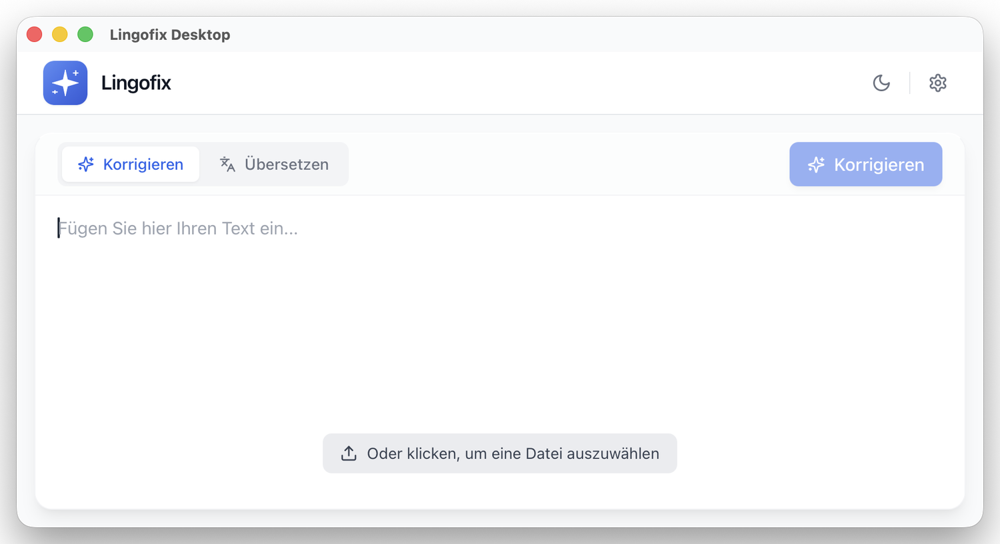

# Lingofix

Lingofix is a desktop app for correcting text, DOCX files, and ODT files with AI.

It is built for people who want fast proofreading help without using a browser-based editor. You can paste plain text, load one or more documents, review the result, and save corrected output on your computer.

<p>
  <a href="https://github.com/pschopen/lingofix-desktop/releases">
    
  </a>
</p>



<sub>Main window with a German interface and the experimental translation mode enabled.</sub>

## What Lingofix Does

- Corrects plain text with AI
- Processes Word and OpenDocument files (`.docx`, `.docm`, `.dotx`, `.dotm`, `.odt`)
- Supports tracked-change style workflows for office documents
- Translates plain text and documents into another language (experimental, see [Translation Mode](#translation-mode-experimental))
- Lets you choose between multiple AI providers, including local models via Ollama
- Adapts its request pace to the provider's rate limit, and resumes interrupted document runs
- Runs as a desktop app for macOS, Windows, and Linux
- Ships a user interface and correction prompts in all 24 official EU languages

## Who It Is For

Lingofix is useful if you want to:

- proofread drafts, emails, reports, or academic text
- improve spelling and grammar while keeping your writing style
- correct Word or OpenDocument files without copying everything into a web form
- use your own AI provider and model

## How It Works

### Plain text

1. Open Lingofix.
2. Open `Settings`.
3. Choose your provider, enter your API key if required, and select a model.
4. Paste your text into the editor.
5. Click `Correct`.
6. Review the highlighted differences and either apply or reject the changes.

### Documents

1. Open Lingofix.
2. Configure your provider and model in `Settings`.
3. Drag one or more documents into the app, or choose files manually.
4. Click `Correct`.
5. Watch progress, remaining-time estimate, and log messages.
6. Open the generated output file from the result banner.

Depending on your compare mode, Lingofix can generate a corrected file with tracked changes or fall back to a corrected output file without generated change markup.

## Download and Installation

Download the latest release from GitHub:

- [Download latest release](https://github.com/pschopen/lingofix-desktop/releases)

### macOS

Choose the correct file for your Mac:

- Apple Silicon (M1, M2, M3, M4): `Lingofix-Desktop-vX.Y.Z-macos-arm64.dmg`
- Intel Mac: `Lingofix-Desktop-vX.Y.Z-macos-x64.dmg`

Install steps:

1. Download the `.dmg` file from the latest release.
2. Double-click the `.dmg` to mount it.
3. In the window that opens, drag `Lingofix Desktop` into the `Applications` folder.
4. Eject the mounted `.dmg` (drag the volume to the Trash, or click the eject icon next to it in Finder).
5. Open Lingofix from `Applications`.

### Windows

Download:

- `Lingofix-Desktop-vX.Y.Z-windows-x64.exe`

Install steps:

1. Download the installer.
2. Run the `.exe` file.
3. Follow the installation wizard.

### Linux

Download:

- `Lingofix-Desktop-vX.Y.Z-linux-x64.flatpak`

Install with Flatpak:

```bash
flatpak install --user ./Lingofix-Desktop-vX.Y.Z-linux-x64.flatpak
flatpak run com.lingofix.desktop
```

## macOS: Open an App From an Unidentified Developer

Lingofix is distributed as an ad-hoc signed `.dmg`. Apple has not notarized it (which requires a paid Apple Developer ID), so the first time you open the app macOS will block it with a message that the developer cannot be verified. This is expected and safe to bypass:

1. After dragging `Lingofix Desktop` into `Applications`, double-click the app once.
2. macOS will show a warning and refuse to open it.
3. Open `System Settings` > `Privacy & Security`.
4. Scroll to the security section near the bottom.
5. Find the message about `Lingofix Desktop.app` being blocked.
6. Click `Open Anyway`.
7. Open the app again.
8. Confirm by clicking `Open` in the dialog.

If `Open Anyway` does not appear immediately, try this fallback:

1. In `Applications`, right-click `Lingofix Desktop.app`.
2. Choose `Open`.
3. Confirm with `Open`.

After that, macOS should allow future launches normally.

## First Start

On the first launch Lingofix shows a short setup wizard with three options:

- **Local & private (free)** — set up [Ollama](https://ollama.com) on your own machine. The wizard can install Ollama, suggests a model that fits your available RAM, and downloads it. No text leaves your computer.
- **Cloud (may incur costs)** — pick a provider (OpenAI, Mistral, OpenRouter, Google AI Studio, Hugging Face), paste an API key, and choose a model. The wizard links directly to each provider's API-key page.
- **Set up later** — skip configuration and choose a provider anytime in `Settings`.

You can run the wizard again later from `Settings` > `Advanced`.

### Manual setup

1. Open `Settings`.
2. Select a provider.
3. Enter the API URL only if your provider requires a custom one.
4. Enter your API key if needed.
5. Click `Load models`.
6. Pick a model.
7. Save the settings.

### Provider notes

- `OpenAI`, `OpenRouter`, `Hugging Face`, `Google AI Studio`, and `Mistral` usually require an API key.
- `Ollama` is for local use and usually works without an API key if Ollama is running on your computer.
- `Custom` is for OpenAI-compatible or other custom endpoints.
- API keys are stored per provider, so switching providers does not lose the previous key.

## Settings Overview

`Settings` is split into sections:

- **General** — provider, API key, API URL, model, and which document parts are processed (main text, footnotes, endnotes, headers, footers, glossary).
- **Correction** — correction language, correction prompt and prompt presets, compare mode, citation normalization, and whitespace handling.
- **Translation** — off by default; see [Translation Mode](#translation-mode-experimental).
- **Advanced** — interface language and font size, system prompt, temperature, reasoning toggle and effort, document processing and speed options, update checks, system paths, wizard re-run, and app reset.

## Working With Plain Text

Lingofix can correct pasted text directly in the editor.

- Type or paste your text into the main editor
- Press `Correct`
- Watch the corrected result stream in
- Review the differences (deletions and additions are highlighted)
- Use `Apply` to keep the correction or `Reject` to discard it

The app is designed to keep the output focused on the corrected text instead of long explanations.

## Working With Documents

You can drop office documents into the app or select them with the file picker. Supported formats are `.docx`, `.docm`, `.dotx`, `.dotm`, and `.odt`.

Typical workflow:

- add one or more files (they are processed one after another)
- start correction
- review progress, remaining-time estimate, and log messages
- open the corrected result from the result banner

If a run is cancelled or interrupted, Lingofix keeps a checkpoint and resumes the same file where it left off instead of starting over.

### Compare modes

Lingofix includes different compare modes for document correction.

#### OpenXML (built-in)

- Built into the app
- Works without Microsoft Word or LibreOffice
- Best for self-contained workflows
- Can change layout or formatting in some cases
- Not recommended for ODT files

#### Word (native)

- Recommended for `.docx` files when Microsoft Word is available
- Requires Microsoft Word
- On macOS, you may need to grant automation permissions the first time

#### LibreOffice UNO (native)

- Useful when working with LibreOffice or `.odt` files
- Requires LibreOffice and the `soffice` command to be available

If an external compare step fails, Lingofix still saves the corrected document instead of discarding the run.

### Processing and speed

Document runs can be tuned in `Settings` > `Advanced`:

- **Batching** — several paragraphs are sent in one request, configurable per document part and limited by characters and paragraph count.
- **Cache** — unchanged paragraphs are not sent again.
- **Parallel requests** — up to 16 concurrent requests.
- **Speed mode** — `Automatic` learns the provider's advertised rate limit from response headers and paces itself, backing off and recovering on its own. `Manual` keeps a fixed requests-per-minute ceiling that you set.

While a run is in progress, the toolbar shows the current percentage, an estimated remaining time, and a notice when the provider throttles the app down to a lower request rate.

## Translation Mode (experimental)

Besides correcting text, Lingofix can translate plain text and documents into another language, reusing the same document pipeline (formatting, footnotes, headers/footers are handled the same way as in correction).

Translation is **experimental and disabled by default**.

### Enabling and using translation

- Turn it on in `Settings` > `Translation`. While it is off, the rest of that section and the mode switch in the main window stay hidden, and the app runs in correction-only mode.
- Once enabled, the main window toolbar shows a `Correct` / `Translate` switch.
- In `Translate` mode, a second dropdown selects the target language: pick one from the curated list, or choose `Other language…` to type a free-text target (e.g. a dialect or a language not in the list — the model is given the name exactly as typed). Typed languages are remembered for later runs.
- Both dropdowns save immediately; no need to open `Settings` first.
- `Settings` > `Translation` also holds the target language and per-language prompt presets for the main text and for footnotes.

### What happens during a translation run

- The output is a plain translated file (`..._translated_<language>.docx`), never a tracked-changes/compare file — a full-text replacement is not something a change-tracking diff can show meaningfully.
- Each paragraph is translated together with the *previous paragraph* as context, so the model has some continuity across a document (useful for footnote follow-citations like "ibid."). Only the original source paragraph is used as context, never an already-translated one.
- Footnotes/endnotes use their own prompt (configurable in `Settings` > `Translation`), separate from the main-text prompt — useful for keeping bibliographic references untouched while translating the surrounding explanation.
- **Fields and table-of-contents entries are not translated** (e.g. `TOC`, page-number fields). Update these manually in Word/LibreOffice after translation (`Update Field`/`Update Table` or similar).
- **Inline formatting mixed within a paragraph can be lost.** Because the model only ever sees and returns plain text (no formatting markers), Lingofix cannot map bold/italic back to the exact same words after translation. A paragraph that is *predominantly* italic or bold stays that way; a single bold/italic word inside otherwise plain text will typically lose that formatting. Paragraph-level formatting (headings, indentation, list styles, etc.) is unaffected, since only the text content is rewritten.
- Interrupted translation runs resume where they left off, the same way correction runs do — switching modes on the same file (e.g. correcting after translating) always starts a fresh run rather than resuming the other mode's progress.

## Updates

Lingofix can check GitHub Releases for updates.

- automatic update checks can run at startup and then once per day
- you can also trigger a manual update check from `Settings`
- download links open the official release page for this repository

## Troubleshooting

### The app cannot connect to my model

Check the following:

- provider is selected correctly
- API key is valid
- API URL is correct
- the selected model is available for that provider
- your local service is running if you use Ollama

### A DOCX or ODT run does not produce tracked changes

That can happen if:

- the selected compare mode is not ideal for the document
- Word or LibreOffice is not available
- the app falls back to a corrected file without generated track changes

For best results:

- use `Word` mode for `.docx` when Microsoft Word is installed
- use `LibreOffice UNO` for `.odt` when LibreOffice is installed

### A document run is very slow

- leave `Speed mode` on `Automatic` so the app can find the provider's rate limit itself
- check the throttle notice in the progress bar: it shows the request rate the provider currently allows
- free provider tiers usually have low request limits; a local Ollama model has none

### The app behaves strangely after a broken configuration

Open `Settings` > `Advanced` and use `Reset app`.

You can also open:

- the temp folder
- `settings.json`
- `debug.log`

directly from the advanced settings section.

## Privacy and Credentials

Lingofix sends text or document content to the AI provider you configure.

Please make sure you understand the privacy and data-handling rules of your chosen provider before processing sensitive material. If you use `Ollama` with a local model, no content leaves your computer.

## For Developers

### Project structure

```text
lingofix-desktop/
  Lingofix.slnx         .NET solution
  frontend/             React + Vite UI
  backend/              .NET document processing backend
  backend.Tests/        Backend unit tests
  tauri/                Tauri desktop host
  scripts/              Build, packaging, and helper scripts
```

### Prerequisites

- Node.js 18+
- .NET SDK 10+
- Rust toolchain

### Setup

```bash
npm run setup
npm run build
```

### Tests

```bash
npm test --prefix frontend
dotnet test backend.Tests/Lingofix.Backend.Tests.csproj
```

### Build targets

- macOS universal workflow helper: `npm run build:app:mac`
- macOS ARM64: `npm run build:app:mac:arm64`
- macOS x64: `npm run build:app:mac:x64`
- Windows x64 installer: `npm run build:app:win`
- Linux Flatpak: `npm run build:app:linux:flatpak`

### Backend binaries only

```bash
npm run prepare:backend:binaries
```

### Release process

GitHub Actions publishes release assets when you push a version tag matching `v*`. Tags must use 3-part semver (e.g. `v0.2.0`); 2-part tags such as `v0.2` are rejected by the `validate-version` CI job.

Version source of truth:

- `tauri/Cargo.toml`

Example:

```bash
git tag v0.1.0
git push origin v0.1.0
```

This produces release assets such as:

- `Lingofix-Desktop-v0.1.0-macos-arm64.dmg`
- `Lingofix-Desktop-v0.1.0-macos-x64.dmg`
- `Lingofix-Desktop-v0.1.0-windows-x64.exe`
- `Lingofix-Desktop-v0.1.0-linux-x64.flatpak`

## License

GNU AGPL v3
